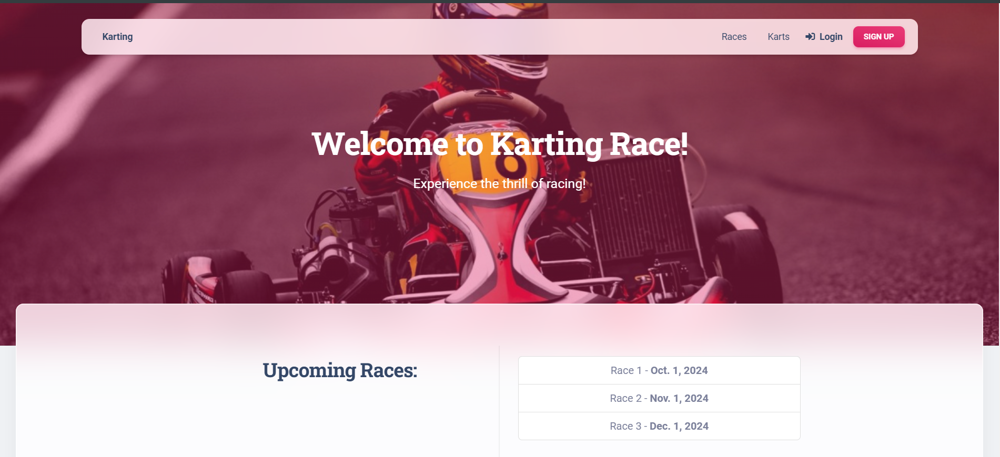

# Karting Race Manager

Welcome to the Karting Race site - a unique place where fans of speed and adrenaline can find everything about exciting karting competitions! The site offers a convenient interface for viewing information about upcoming races, available go-kart models, as well as the ability to register for events.

Main functions: Race calendar: Check the schedule of upcoming karting competitions, find out about the dates carrying out. Go-Kart Review: Explore the various go-kart models, their features and capabilities. Registration: Easily register to race.

## Check out the live version [here](https://karting-race-manager.onrender.com/)

## Developing

Here's a brief intro about what a developer must do in order to start developing
the project further:

```shell
git clone https://github.com/yashkunn/karting-race-manager.git
cd karting_race_manager/
pip install -r requirements.txt
python manage.py loaddata karting/fixtures/initial_data.json
```

```
Apply migrations: python manage.py migrate

Run the server: python manage.py runserver
```


## Features

* Race Management: The primary feature of the site is allowing users to view and explore upcoming karting races, including detailed information on race dates and times.
* Karts Overview: You can also browse through a list of available karts, offering an in-depth look at each model’s specifications and availability.
* User Authentication: If you’re feeling adventurous, users can register and log in, gaining access to personalized race information and exclusive features like signing up for races.
* These features make the Karting Race website an all-in-one platform for racing enthusiasts!


## Contributing

If you'd like to contribute, please fork the repository and use a feature branch. Pull requests are warmly welcome.


